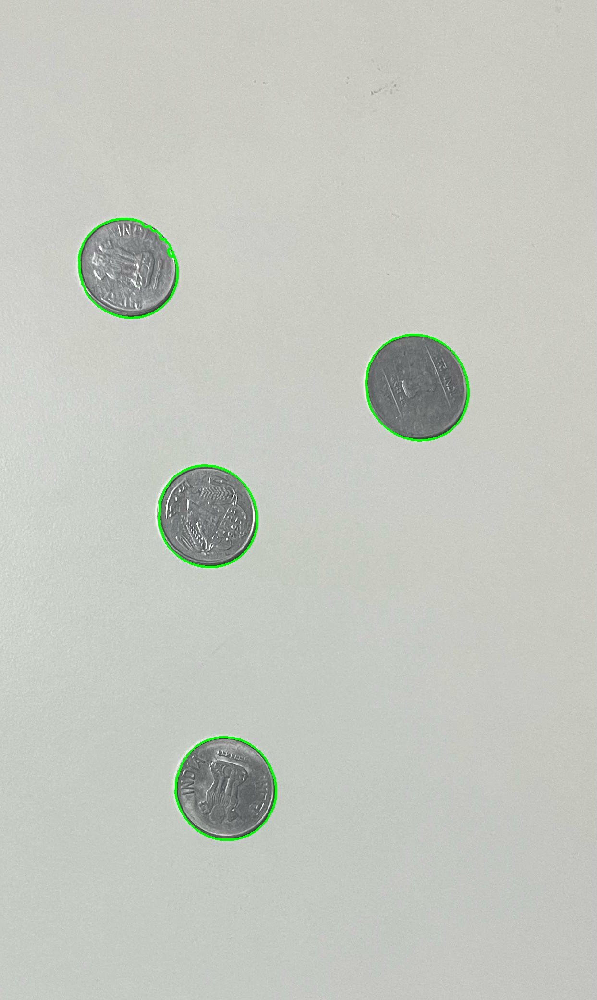
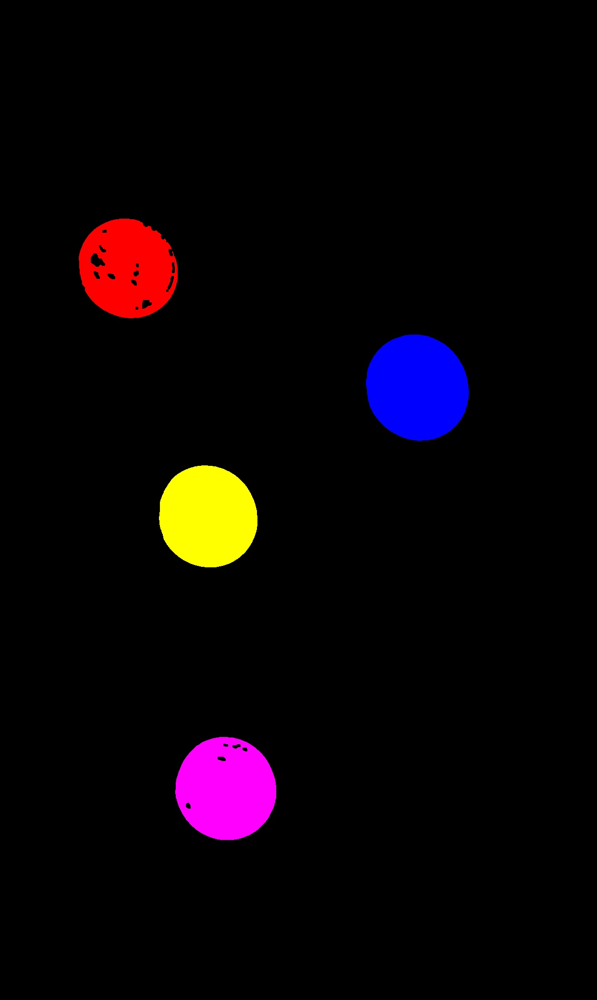
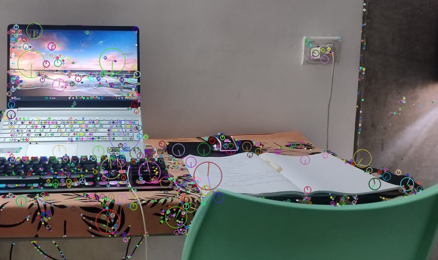
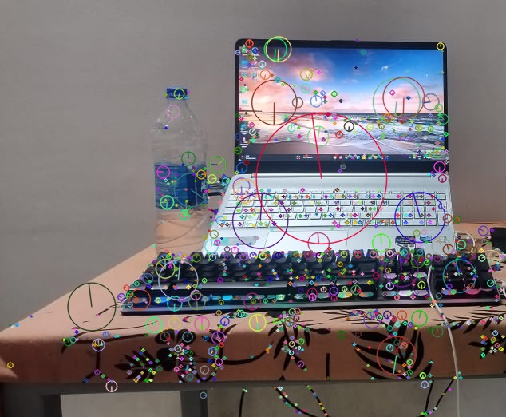
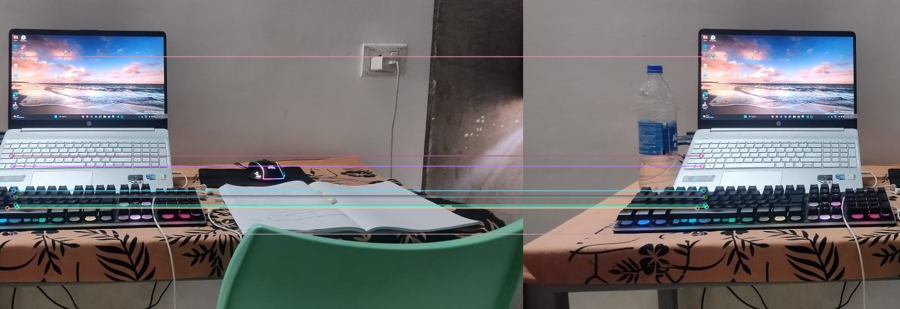
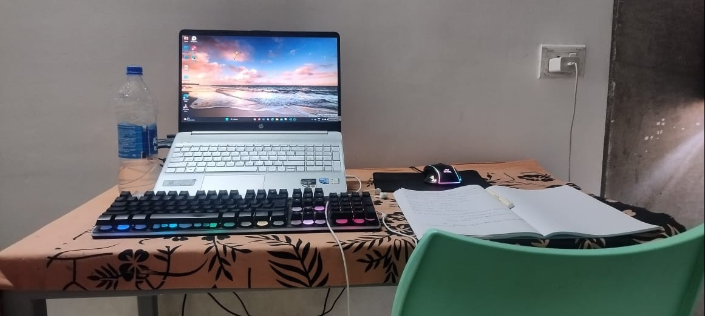

# VR Assignment 1 - Adarsha IMT2022069

## Overview

This repository contains two Python scripts for **coin detection** and **image stitching** using OpenCV.

## Repository Structure

- **input_IMAGES/**: Contains input images used in the project.
- **Output_IMAGES/**: Contains the output images
- **PythonScripts/**: Contain two files : coin\_detection.py – Detects, counts, and segments coins in an image,stitching.py – Stitches two images together to create a panorama.
- **.gitignore**: add your local environment to avoid pushing into your repo
- **requirements.txt**: Lists the dependencies required for running the scripts.

### Installation

To install the required dependencies, run:

```sh
pip install -r requirements.txt
```

---

## Part 1: Coin Detection

### Running the Script

Run the following command to execute the coin detection script:

```sh
python coin_detection_IMT2022069.py
```

### Features

-Converts the image to grayscale and applies median blur to reduce noise.

-Uses Otsu’s thresholding and morphological closing to segment the coins.

-Extracts contours using cv2.findContours() and highlights detected coins.

-Uses color.label2rgb() to colorize segmented regions and prints the total coin count.

-Saves the detected coins and segmented image in the output/ directory.

-Displays the original, detected, and segmented images side by side.

-Returns the number of detected coins.

### Key Functions Used

-`cv2.imread()` – Reads the input image from the specified path.

-`cv2.cvtColor()` – Converts the image to grayscale and RGB formats.

-`cv2.medianBlur()` – Applies median filter for noise reduction.

-`cv2.threshold()` – Performs image thresholding using Otsu’s method.

-`cv2.morphologyEx()` – Executes morphological closing for noise removal.

-`skimage.measure.label()` – Assigns unique labels to segmented objects.

-`skimage.color.label2rgb()` – Assigns colors to labeled regions for visualization.

-`cv2.findContours()` – Detects external contours in the processed image.

-`cv2.drawContours()` – Draws contours on the detected coins.

-`cv2.imwrite()` – Saves detected images to the output/ directory.

-`matplotlib.pyplot` – Used to visualize the original, detected, and segmented images.

## Output

- **Part 1**: Detected coins with segmentation and total count displayed.  
***Detected Coins***
    
***Segmented Coins***  
    

## Part 2: Image Stitching

### Running the Script

Run the following command to execute the image stitching script:

```sh
python stitching_IMT2022069.py
```

### Features

-Loads and preprocesses input images (grayscale conversion for feature detection).

-Detects keypoints and extracts feature descriptors using SIFT.

-Matches keypoints using the Brute Force Matcher (BFMatcher) with cross-checking.

-Computes a homography matrix for image alignment.

-Warps and blends images to create a stitched output.

-Crops black regions from the final stitched image.

-Saves and visualizes intermediate and final outputs.


### Key Functions Used

`cv2.imread(image_path)`-Reads the input image from the specified path.

`cv2.cvtColor(image, cv2.COLOR_BGR2GRAY)`-Converts the image to grayscale for feature detection.

`cv2.SIFT_create()`-Initializes the SIFT (Scale-Invariant Feature Transform) detector.

`sift.detectAndCompute(image_gray, None)`-Detects keypoints and computes feature descriptors.

`cv2.drawKeypoints(image_rgb, keypoints, None, flags=cv2.DRAW_MATCHES_FLAGS_DRAW_RICH_KEYPOINTS)`-Draws keypoints on the image for visualization.

`cv2.BFMatcher(cv2.NORM_L2, crossCheck=True)`-Initializes a brute-force matcher with L2 norm and cross-checking.

`matcher.match(desc1, desc2)`-Matches feature descriptors between two images.

`cv2.findHomography(src_pts, dst_pts, cv2.RANSAC, 5.0)`-Computes the homography matrix using RANSAC to filter out outliers.

`cv2.warpPerspective(image1, H, (w2 * 2, h2))`-Warps one image to align with another using the computed homography matrix.

`cv2.threshold(gray, 1, 255, cv2.THRESH_BINARY)`-Performs binary thresholding to identify non-black regions for cropping.

`cv2.boundingRect(coords)`-Computes the bounding box around the non-black region to crop the final output.

`cv2.imwrite(path, image)`-Saves processed images to the specified output folder.

`matplotlib.pyplot functions`-Used to visualize keypoints, feature matches, and the final stitched image.
---

## Output


- **Part 2**: Final stitched panorama from the input images.
  ***Detected KeyPoints***  
  
  
  ***Image Matches***  
  
  ***Final Panorama***
  
  

---
